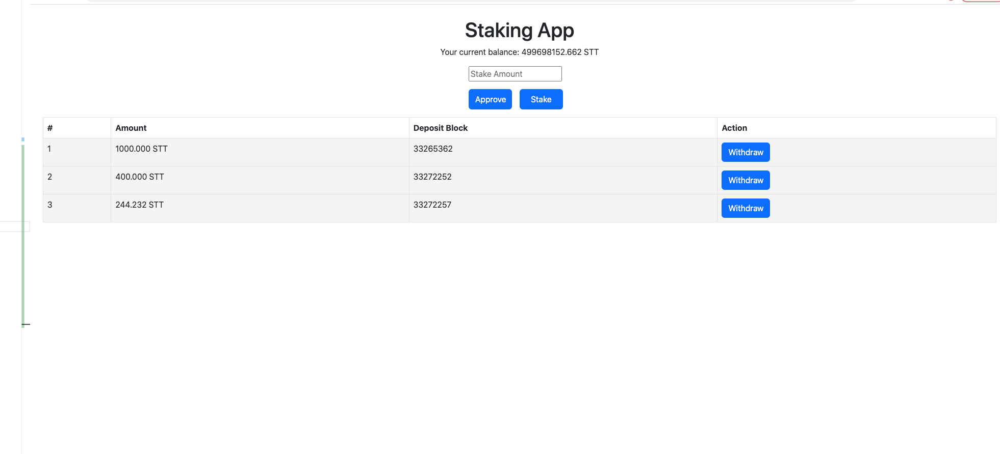

# Staking Contracts
### Project setup
1. Install `yarn npm -g yarn`
2. Install packages `yarn`
3. Compile contract `yarn compile`
4. Put values in .env file for Ref we can use .env.example
5. Deploy contract on private chain or testnet 

### Setup of own private chain using hardhat
```typescript
npx hardhat node // setup local blockchain 
yarn deploy --network localhost // deploy on local blockchain 

```
### Deploy contracts on testnet
```typescript
npx hardhat accounts --network testnet // to check the list of accounts
npx hardhat node // setup local blockchain 
yarn deploy --network testnet // deploy on local blockchain 

npx hardhat verify --network testnet 0x3Ac6593e44c02B6f26134a5c6f6c97f97923fD62 "Staking Token" "STT" "8"
npx hardhat verify --network testnet 0xBD0ed2ba860546d43b23FaE11D77D2e7E47eEEAf "0x3Ac6593e44c02B6f26134a5c6f6c97f97923fD62" 20000000000000000 10

```

### Test cases 
In test cases we are staking and withdrawing funds along with token and staking contract deployment.
1. Test case without interest 
2. Test case with compound interest

```typescript
npx hardhat node // setup local blockchain 
yarn test --network localhost // this will run all test cases on local node
```

### Contract address
1. STT Token https://mumbai.polygonscan.com/address/0x3Ac6593e44c02B6f26134a5c6f6c97f97923fD62#code
2. Staking Contract https://mumbai.polygonscan.com/address/0xBD0ed2ba860546d43b23FaE11D77D2e7E47eEEAf#code


# Staking Dapp 


### Features
1. Approve funds 
2. Stake funds (Single user can stake multiple time)
3. Withdraw funds
4. User Wallet Balance for Staking Token
5. User Staking list
6. APY for Staking which 2% compound interest every 10 blocks


### Setup
```typescript
yarn // install dependency 
npm start run the server

//Prerequisite 
1. Metamask install on browser
2. We are using polygon mumbai testnet (Ref : https://docs.mobius.finance/resourses/testnet-guides-mumbai-network/connect-to-polygons-testnet)

```
### Contract address
1. STT Token https://mumbai.polygonscan.com/address/0x3Ac6593e44c02B6f26134a5c6f6c97f97923fD62#code
2. Staking Contract https://mumbai.polygonscan.com/address/0xBD0ed2ba860546d43b23FaE11D77D2e7E47eEEAf#code
