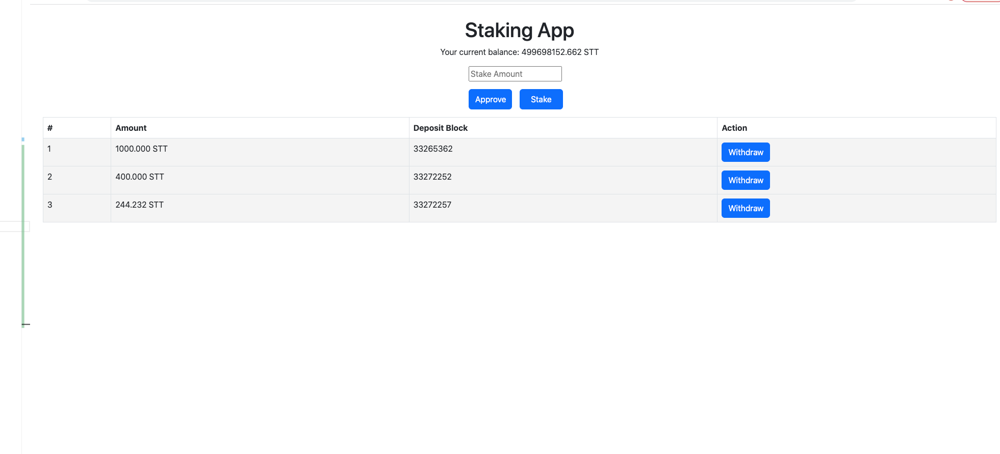

# Staking Dapp 


### Features
1. Approve funds 
2. Stake funds (Single user can stake multiple time)
3. Withdraw funds
4. User Wallet Balance for Staking Token
5. User Staking list
6. APY for Staking which 2% compound interest every 10 blocks


### Setup
```typescript
yarn // install dependency 
npm start run the server

//Prerequisite 
1. Metamask install on browser
2. We are using polygon mumbai testnet (Ref : https://docs.mobius.finance/resourses/testnet-guides-mumbai-network/connect-to-polygons-testnet)

```
### Contract address
1. STT Token https://mumbai.polygonscan.com/address/0x3Ac6593e44c02B6f26134a5c6f6c97f97923fD62#code
2. Staking Contract https://mumbai.polygonscan.com/address/0xBD0ed2ba860546d43b23FaE11D77D2e7E47eEEAf#code
```